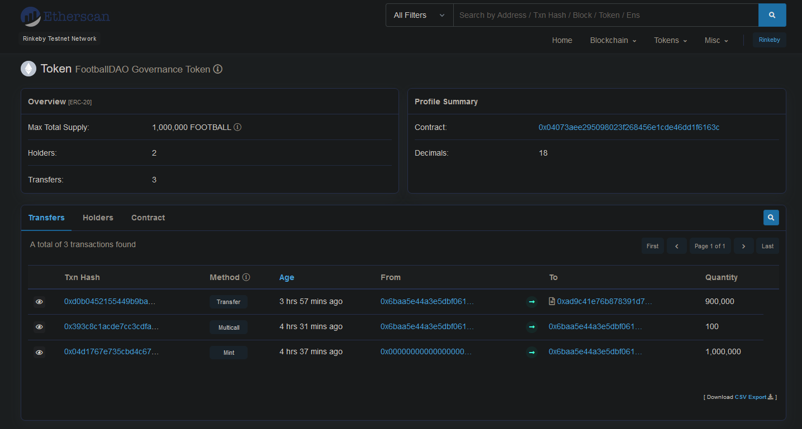
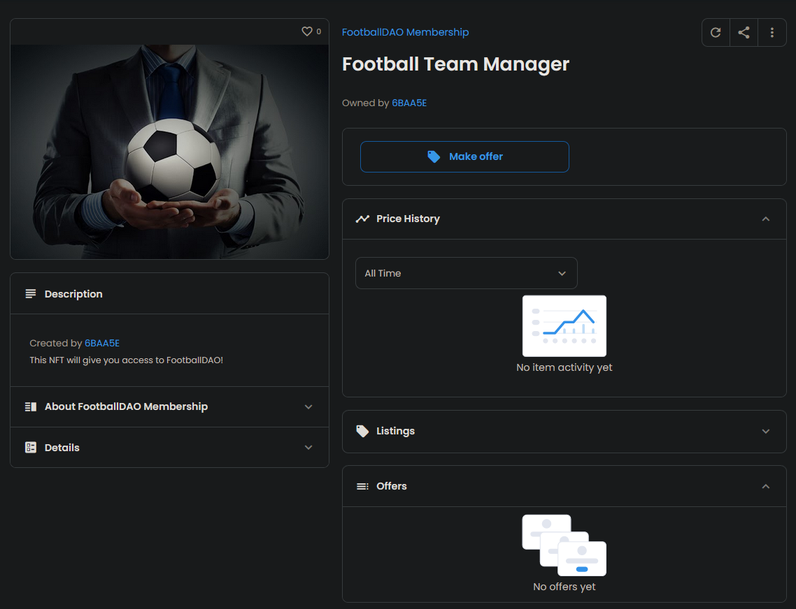
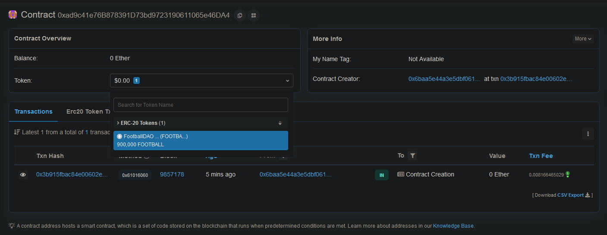
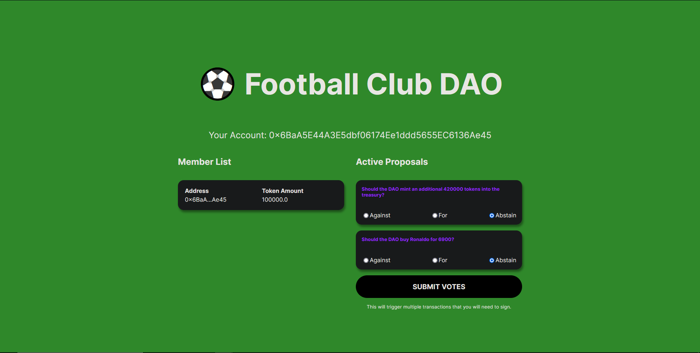

# Football-DAO

## What's a DAO?

A decentralized autonomous organization (DAO) is an entity with no central leadership. Decisions get made from the bottom-up, governed by a community organized around a specific set of rules enforced on a blockchain

This project was made with [@buildspace](https://github.com/buildspace) and [@thirdweb](https://github.com/nftlabs) and it focuses on what a DAO is and how it one works.

### [View Demo](https://kn0wn-un.github.io/Football-DAO/)

## ✅ deployed my own custom ERC-20 token

## ✅ deployed my own ERC-1155 NFT people can mint to join my DAO.

## ✅ deployed my own governance contract + treasury.

## ✅ built a dapp that lets people connect their wallet, get an NFT, see a DAO Dashboard where they can see other members + actually vote on proposals that are executed directly by the governance contract.

